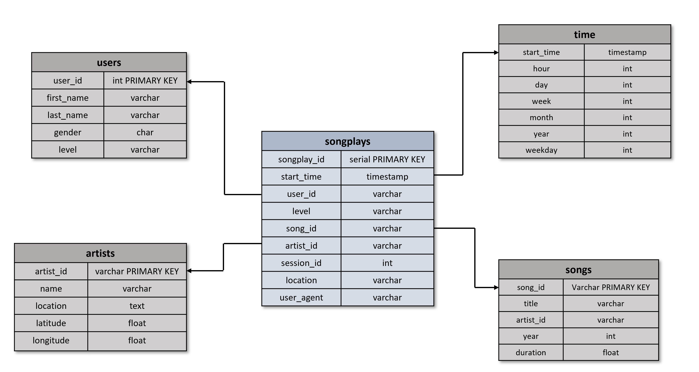

# Data Modeling with Postgres
## Introduction
A startup called Sparkify wants to analyze the data they've been collecting on songs and user activity on their new music streaming app. The analytics team is particularly interested in understanding what songs users are listening to. In this project, a Postgres database was created with tables designed to optimize queries on song play analysis. More specifically, in this project the database schema is designed. As the original datasets were in JSON format the corresponding ETL pipeline was also created. 

### Schema 
We have chosen to create a Star schema for our database. The star schema is the simplest of the database schemas. One of the benefits of the star schema is that it is easy to make aggregations which in this particular case may be needed to analyze the data and subsequently extract valuable information. 
Our schema consists of one Fact Table and 5 Dimension Tables:

Fact table: 
- **songplays**: records in log data associated with song plays. Includes the columns: songplay_id, start_time, user_id, level, song_id, artist_id, session_id, location, user_agent

#### Dimension Tables 

- **users**: Users in the app. Includes the columns: user_id, first_name, last_name, gender, level
- **songs**: Songs in music database. Includes the columns: songs in music database
- **artists**: Artists in music database. Includes the columns: artist_id, name, location, latitude, longitude
- **time**: Timestamps of records in songplays broken down into specific units. Includes the columns: Start_time, hour, day, week, month, year, weekday

Below is the image of the schema:

### ETL process

**Step 1**: The ETL process is done in the etl.py script. The loading of the data for the Song and Log dataset is done with the help of the Pandas library. 

**Step 2**: Then the necessary transformations are done on the data (if needed) and the corresponding columns are selected for each table. 

**Step 3**: Finally the corresponding INSERT query is executed to load the data into the tables of the database. 

**Step 4**: The above procedure is repeated for each JSON file to fill the tables

### Data

The initial data are in JSON format. There are two datasets the Song Dataset and the Log dataset:

- **The Song Dataset**: In this dataset, each file is in JSON format and contains metadata about a song and the artist of that song. The files are partitioned by the first three letters of each song's track ID.
- **The log Dataset**: This dataset consists of log files in JSON format generated by this event simulator based on the songs in the dataset above. These simulate activity logs from a music streaming app based on specified configurations. The log files in the dataset are partitioned by year and month.

### scripts

- **sql_queries**: This script contains all CREATE, INSERT, and DROP queries for all tables
- **create_tables**: This script creates the database and uses the queries from sql_queries.py to create all the tables
- **etl.py**: This script extracts the data from the JSON files, does the necessary transformations and loads the data into the database tables
- **etl.ipynb**: An assisting notebook for the implementation of etl process
- **test.ipynb**: A notebook for the validation of the results
- **data**: The initial song and log data in JSON format
- **images**: File with the images

### How to run the scripts

In order to create the tables and complete the etl process please run these commands below with this order in a terminal:

python create_tables.py
python etl.y

You can also run the Sample_queries notebook to generate the sample queries.

### Example queries
Αn additional notebook was created to generate two sample queries that answer two different questions.

The first query returns the number of paid and free level for every gender (Male and Female). Pandas library is used to visualize this table.

Result:

The second query is more complex and returns the top 10 most frequent users, their names and gender that used this app.

Result: 

# Acknowledgements
I wish to thank Udacity for the guidance and the invaluable feedback they provided
